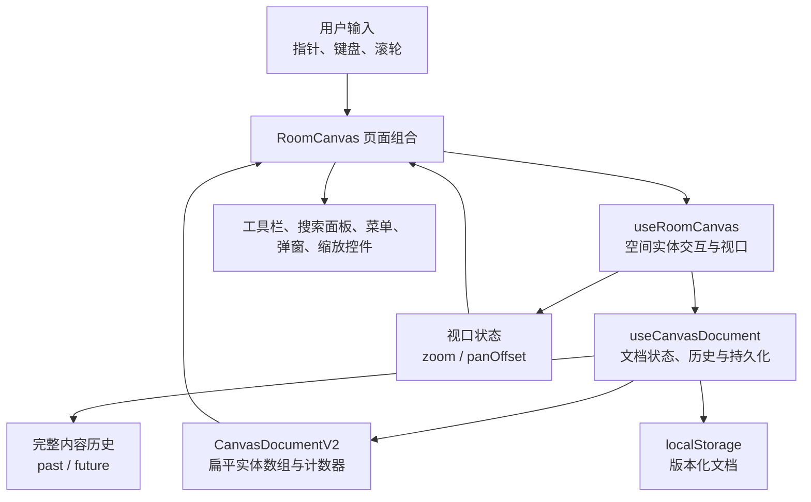
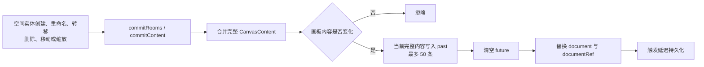
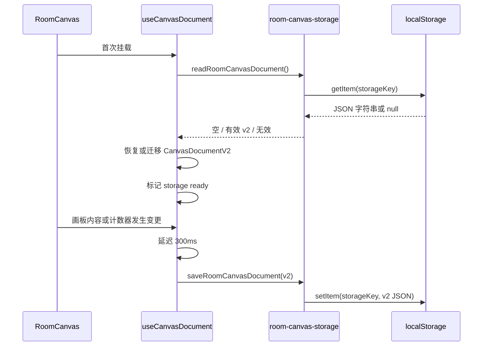

# 家居布局画板架构设计文档

## 1. 文档说明

- 文档状态：当前实现基线
- 适用版本：`zhijian-hub@0.1.0`
- 最后核对：2026-07-19
- 维护范围：当前模块边界、数据模型、状态流转和技术决策
- 关联代码：`src/app/`、`src/components/`、`src/lib/`、`src/styles/`

## 2. 系统概览

当前系统是一个纯前端单页面家居布局画板。Next.js App Router 负责页面入口和构建，React 组件负责界面组合，自定义 Hook 分别管理画板文档与房间交互，浏览器 `localStorage` 负责本地持久化。

当前没有 API Route、服务端业务状态、数据库、账号体系或全局状态库。



## 3. 技术栈

| 类别          | 当前选型                     | 作用                            |
| ------------- | ---------------------------- | ------------------------------- |
| 运行环境      | Node.js 24.11.1              | 加载 Next.js SWC 并执行工程脚本 |
| 框架          | Next.js 15.5.20 App Router   | 页面入口、构建和生产运行        |
| UI            | React 19.1.0                 | 组件渲染和 Hooks 状态管理       |
| 语言          | TypeScript 5.8.3             | 严格类型检查                    |
| 样式          | CSS Modules + CSS 变量       | 组件隔离样式和主题令牌          |
| 类名组合      | clsx 2.1.1                   | 条件类名组合                    |
| 单元/集成测试 | Vitest 3.2.6                 | 测试执行                        |
| 组件测试      | React Testing Library 16.3.2 | 按用户行为测试组件              |
| 代码质量      | ESLint + Prettier            | 静态检查和格式化                |
| 持久化        | 浏览器 localStorage          | 保存版本化画板文档              |

## 4. 目录与模块边界

```text
src/
├── app/
│   ├── layout.tsx                   # 根布局和页面元数据
│   ├── page.tsx                     # 首页，只组合 RoomCanvas
│   ├── page.module.css
│   └── globals.css                  # 全局重置并导入 token/theme
├── components/
│   ├── features/room-canvas/        # 画板业务组件
│   ├── site/                        # 品牌组件
│   └── ui/                          # Button、Input、Dialog 等原子组件
├── lib/
│   ├── hooks/                       # 画板与键盘 Hook
│   ├── types/                       # 画板共享类型
│   └── utils/                       # 画板纯函数、存储和通用工具
└── styles/
    ├── tokens.css                   # 间距、字号、圆角等刻度
    └── theme.css                    # 颜色、阴影、字体和过渡
```

依赖方向保持为：`app → features → ui/lib`。业务逻辑不放入 `app`，原子 UI 不依赖房间业务。

## 5. 核心模块职责

| 模块                              | 职责                                                  |
| --------------------------------- | ----------------------------------------------------- |
| `src/app/page.tsx`                | 提供首页语义结构并挂载画板                            |
| `room-canvas.tsx`                 | 组合画布、实体节点、浮层和弹窗；把 Hook 状态映射为 UI |
| `canvas-nodes.tsx`                | 渲染房间、家具和房间级储物设备及八方向缩放手柄        |
| `use-room-canvas.ts`              | 管理实体交互、物品编辑、位置转移、级联删除和视口定位  |
| `use-canvas-document.ts`          | 管理版本化文档、完整内容历史、计数器和持久化时机      |
| `toolbar.tsx`                     | 展示工具切换、添加、撤销/重做和清空按钮               |
| `canvas-actions.tsx`              | 管理实体搜索、房间总览和右侧功能区开关                |
| `canvas-details.tsx`              | 渲染房间、家具和储物设备详情及位置选择器              |
| `canvas-items.tsx`                | 渲染物品列表以及名称、数量和位置编辑表单              |
| `canvas-overlay.tsx`              | 统一阻止浮层指针/右键事件冒泡，按需阻止滚轮冒泡       |
| `zoom-control.tsx`                | 展示缩放比例和缩放按钮                                |
| `context-menu.tsx`                | 通用右键菜单定位、键盘导航和焦点恢复                  |
| `dialog.tsx` / `input-dialog.tsx` | 通用弹窗和实体重命名输入流程                          |
| `room-canvas.ts`                  | 创建空间实体、计算缩放与边界矩形等纯函数              |
| `room-canvas-storage.ts`          | 校验 v1/v2 文档、执行 v1 内存迁移并统一写入 v2        |
| `src/lib/types/room-canvas.ts`    | 定义版本化文档、领域实体和画板交互类型                |

## 6. 数据模型

### 6.1 房间

```ts
interface Room {
    id: string;
    name: string;
    x: number;
    y: number;
    width: number;
    height: number;
}
```

房间使用画板坐标系。`x`、`y` 表示左上角，`width`、`height` 表示尺寸。当前所有字段均为房间历史和本地存储的一部分。

### 6.2 本地文档

```ts
interface CanvasDocumentV2 {
    version: 2;
    counters: {
        room: number;
        furniture: number;
        storageDevice: number;
        item: number;
    };
    rooms: Room[];
    furniture: Furniture[];
    storageDevices: StorageDevice[];
    items: Item[];
}
```

- `version` 固定为 2，用于识别当前持久化格式。
- `counters` 保证各类实体默认名称序号稳定，计数器不进入历史。
- 四类实体以扁平数组保存，通过 ID 建立关系；房间、家具、储物设备和物品均已投入使用。

读取存储时会校验实体字段、有限数值、正尺寸、非负计数器、ID 唯一性和父级关系。合法 v1 文档在内存中迁移为 v2，保留房间与原序号；读取本身不改写 localStorage。解析失败、结构异常或版本不兼容时返回无效状态，用户未产生新变更前不会自动覆盖原始数据。保存入口只写入 v2。

### 6.3 家具

```ts
interface Furniture {
    id: string;
    roomId: string;
    name: string;
    x: number;
    y: number;
    width: number;
    height: number;
}
```

家具坐标相对于所属房间左上角。渲染时通过 `room.x + furniture.x` 和 `room.y + furniture.y` 转换为画板坐标，因此移动房间不需要重写家具数据。家具创建、移动、缩放和转移均经过边界钳制。

### 6.4 储物设备

```ts
type StorageDevice =
    | {
          id: string;
          name: string;
          location: { kind: 'room'; roomId: string };
          rect: Rect;
      }
    | {
          id: string;
          name: string;
          location: { kind: 'furniture'; furnitureId: string };
      };
```

房间级储物设备的 `rect` 使用相对房间坐标，并与家具复用空间边界规则。家具内储物设备只保存逻辑父级。位置切换通过联合类型整体替换：移入家具时移除 `rect`，移入房间时在目标房间中心生成并钳制默认矩形。

### 6.5 物品

```ts
interface Item {
    id: string;
    name: string;
    quantity: number;
    location:
        | { kind: 'room'; roomId: string }
        | { kind: 'furniture'; furnitureId: string }
        | { kind: 'storage-device'; storageDeviceId: string };
}
```

物品不保存二维坐标，只保存名称、正整数数量和一个互斥位置。位置修改时整体替换 `location`，界面通过当前实体关系实时派生完整路径。

## 7. 状态设计

`useCanvasDocument` 管理领域状态、计数器、历史和持久化，`useRoomCanvas` 管理交互与视口。两个 Hook 都使用 React State 驱动渲染，并通过 Ref 为连续交互和页面退出保存提供最新值。

| 状态类别   | 主要字段                                        | 所属 Hook           | 是否持久化 | 是否进入历史 |
| ---------- | ----------------------------------------------- | ------------------- | ---------- | ------------ |
| 领域内容   | `rooms`、`furniture`、`storageDevices`、`items` | `useCanvasDocument` | 是         | 是           |
| 实体计数器 | `counters`                                      | `useCanvasDocument` | 是         | 否           |
| 历史状态   | `past`、`future`、`canUndo`、`canRedo`          | `useCanvasDocument` | 否         | 内存本身     |
| 选择与提示 | `selectedEntity`、实体与物品高亮                | `useRoomCanvas`     | 否         | 否           |
| 交互状态   | `interaction`                                   | `useRoomCanvas`     | 否         | 否           |
| 浮层状态   | 右键菜单、重命名、删除确认和物品编辑器          | `useRoomCanvas`     | 否         | 否           |
| 绘制状态   | `drawingTarget`（实体类型和目标房间）           | `useRoomCanvas`     | 否         | 否           |
| 视口状态   | `zoom`、`panOffset`、`isFocusing`               | `useRoomCanvas`     | 否         | 否           |
| 工具状态   | `tool`                                          | `useRoomCanvas`     | 否         | 否           |

## 8. 实体变更与历史记录

领域内容变更统一由 `useCanvasDocument` 提交。房间操作可经过 `commitRooms`，家具、储物设备、物品和级联操作经过 `commitContent`；两个入口最终都比较完整 `CanvasContent`，再写入历史并替换当前文档。



### 8.1 拖拽交互

移动和缩放期间需要即时渲染，因此指针移动调用 `replaceRooms` 或 `replaceContent`，不逐帧写历史。交互开始时保存完整内容，指针抬起或取消时一次性记录前后快照。

家具和房间级储物设备绘制使用相对房间坐标。指针坐标先转换到画板坐标，再减去房间原点并钳制到房间宽高范围。房间缩小时会根据两类空间子节点的最远边界计算最小可用尺寸，避免产生越界实体。

指针移动通过 `requestAnimationFrame` 合并同一帧内的高频事件，减少无意义渲染。

### 8.2 撤销与重做

- 撤销：从 `past` 取出上一个快照，把当前快照压入 `future`。
- 重做：从 `future` 取出下一个快照，把当前快照压入 `past`。
- 快照包含四类实体数组，不包含默认命名计数器。
- 恢复快照后，如果原选中实体已经不存在，则清除选择。
- 恢复时关闭右键菜单和重命名弹窗。
- 非空闲交互期间忽略撤销/重做，避免状态竞争。

## 9. 坐标、平移与缩放

### 9.1 坐标转换

指针事件首先转换为相对画布视口坐标，再结合当前平移量和缩放比例转换为画板坐标：

```text
worldX = (viewX - panOffset.x) / zoom
worldY = (viewY - panOffset.y) / zoom
```

启用网格吸附时，坐标按 `Math.round(value / gridSize) * gridSize` 对齐。

### 9.2 渲染变换

- 点阵背景使用当前缩放比例计算 `background-size`。
- 背景位置使用 `panOffset`。
- 实体容器统一应用 `translate(panOffset) scale(zoom)`。
- 房间使用画板坐标；家具和房间级储物设备在渲染时把相对房间坐标转换为画板坐标。

### 9.3 视口中心缩放

缩放前先计算当前视口中心对应的画板坐标，再反推新比例下的平移量，使视口中心内容保持稳定。

## 10. 搜索、详情与实体定位

搜索面板壳保留在 `CanvasActions`，实体详情由 `CanvasDetails` 承担：

- 对查询词和四类实体名称执行 `toLocaleLowerCase('zh-CN')`。
- 使用包含匹配生成结果列表。
- 家具、储物设备和物品结果实时解析所属路径，不维护独立搜索索引。
- 房间详情负责创建和列出空间子实体；家具详情负责逻辑储物设备；三类容器详情均展示直接物品并提供添加入口。
- 物品表单统一编辑名称、数量和位置，位置选项由当前房间、家具和储物设备数组实时生成。

空间实体结果调用 `focusEntity`；物品结果调用 `focusItem`，先解析最终容器，再复用实体定位流程：

1. 查找目标所属房间和画布尺寸。
2. 计算带 96 像素视口边距的适配比例。
3. 只在必要时缩小，不主动放大当前视口。
4. 计算让房间中心与视口中心重合的平移量。
5. 选中并高亮最终实体；逻辑储物设备在详情头部高亮，物品在容器详情列表中高亮。
6. 启用 800 毫秒视口过渡，高亮持续 1800 毫秒。

用户开始新的画布交互或手动缩放时会调用 `cancelFocusTransition`，终止定位过渡。

## 11. 本地持久化流程



首次读取只恢复内存状态，不触发延迟保存。有效 v1 文档会在下一次真实变更或 `pagehide` 时统一写为 v2；空存储和无效存储在用户未产生新变更前不会写入。页面触发 `pagehide` 时会使用 Ref 中的最新完整文档立即保存。

存储失败被视为非致命错误，存储函数返回 `false`，画板仍保持当前内存状态。

## 12. 浮层与事件隔离

顶部工具栏、右上角功能区和右下角缩放控件都位于画布 DOM 内。为避免浮层操作冒泡到画布：

- `CanvasOverlay` 统一阻止 `pointerdown` 和右键菜单事件冒泡。
- 搜索面板额外阻止滚轮冒泡，面板内部滚动不会缩放画布。
- 右键菜单在 `document` 捕获阶段监听外部指针事件，保证点击画布空白处也能关闭。
- 弹窗和菜单各自负责焦点进入、键盘导航和焦点恢复。

## 13. 样式架构

样式采用三层结构：

1. `tokens.css`：间距、字号、行高、字重和圆角刻度。
2. `theme.css`：颜色、字体、阴影、焦点样式和过渡。
3. `*.module.css`：组件局部布局和状态样式。

当前圆角语义：

| Token         | 值   | 使用范围                 |
| ------------- | ---- | ------------------------ |
| `--radius-sm` | 4px  | 房间和绘制预览           |
| `--radius`    | 6px  | 按钮和输入框             |
| `--radius-lg` | 10px | 工具栏、菜单和弹窗等浮层 |

主题仅提供亮色模式，以朱砂红为主色、宣纸白为背景、墨色为正文颜色。全局 `prefers-reduced-motion` 规则会压缩动画和过渡时间，房间定位样式也提供专门降级。

## 14. 测试架构

当前测试分为四组：

| 测试文件                       | 覆盖内容                                         |
| ------------------------------ | ------------------------------------------------ |
| `room-canvas.test.ts`          | 空间实体创建、缩放和房间内边界纯函数             |
| `room-canvas-storage.test.ts`  | v2 保存读取、v1 迁移、异常数据和实体关系校验     |
| `use-canvas-document.test.tsx` | 完整内容历史、计数器隔离、旧序号恢复和 v2 持久化 |
| `accessibility.test.tsx`       | 弹窗、菜单、空间实体操作、搜索、历史和持久化     |

Vitest 使用 `jsdom` 和 `pretendToBeVisual`，路径别名与应用一致。统一质量门禁为：

```bash
npm run check
```

该命令依次执行 Prettier 格式检查、ESLint、TypeScript 类型检查和全部 Vitest 测试。

## 15. 当前架构约束

- 当前四类领域实体均具备用户界面；物品只在详情列表和搜索结果中渲染，不创建画布节点。
- 领域文档由 `useCanvasDocument` 本地维护，不引入 Context 或全局 Store。
- 页面只有一个业务入口，不使用路由级状态或跨页面共享状态。
- localStorage 是当前唯一持久化介质，不与服务端同步。
- 搜索直接过滤当前四类实体数组，不建立缓存索引。
- 历史使用最多 50 条完整画板内容快照，不使用命令模式或增量补丁。
- 组件和工具函数只在出现明确职责边界时拆分，不提前建立通用实体抽象。

## 16. 文档同步要求

后续代码变更必须按影响范围同步维护文档：

| 变更类型                                     | 必须同步的文档                               |
| -------------------------------------------- | -------------------------------------------- |
| 新增、删除或调整用户功能                     | 《需求文档》《功能文档》                     |
| 修改快捷键、默认值、交互规则或可访问性行为   | 《需求文档》《功能文档》                     |
| 修改目录、模块职责、依赖关系或状态归属       | 本文档                                       |
| 修改数据模型、历史策略、坐标规则或持久化格式 | 本文档；影响用户行为时同时更新需求和功能文档 |
| 修改技术栈、构建、测试工具或质量门禁         | 本文档和项目 README                          |

架构文档只记录已落地事实。尚未实现的实体扩展继续保留在独立方案文档中，不提前写入当前架构。
