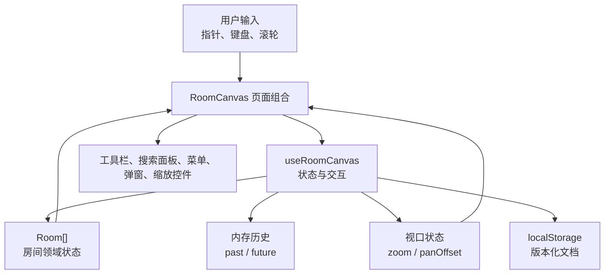
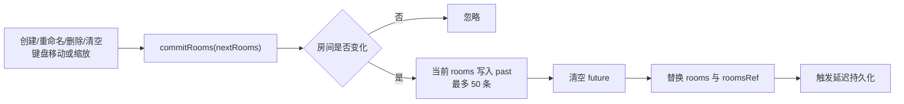
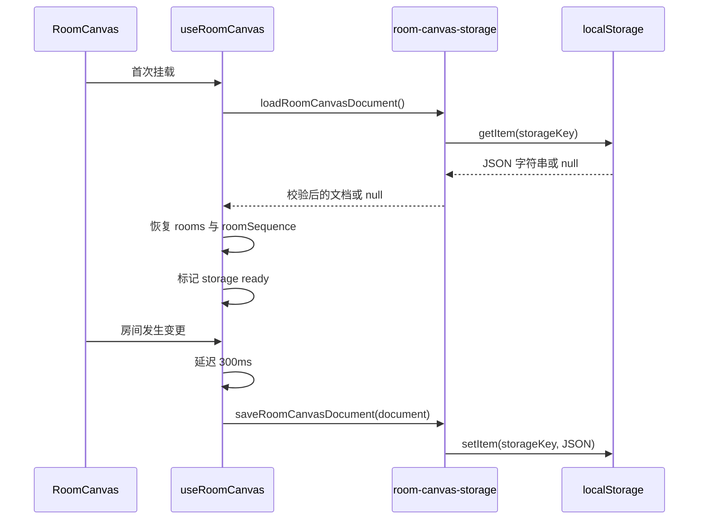

# 家居布局画板架构设计文档

## 1. 文档说明

- 文档状态：当前实现基线
- 适用版本：`zhijian-hub@0.1.0`
- 最后核对：2026-07-18
- 维护范围：当前模块边界、数据模型、状态流转和技术决策
- 关联代码：`src/app/`、`src/components/`、`src/lib/`、`src/styles/`

## 2. 系统概览

当前系统是一个纯前端单页面家居布局画板。Next.js App Router 负责页面入口和构建，React 组件负责界面组合，自定义 Hook 管理画板状态与交互，浏览器 `localStorage` 负责本地持久化。

当前没有 API Route、服务端业务状态、数据库、账号体系或全局状态库。



## 3. 技术栈

| 类别          | 当前选型                     | 作用                      |
| ------------- | ---------------------------- | ------------------------- |
| 框架          | Next.js 15.5.20 App Router   | 页面入口、构建和生产运行  |
| UI            | React 19.1.0                 | 组件渲染和 Hooks 状态管理 |
| 语言          | TypeScript 5.8.3             | 严格类型检查              |
| 样式          | CSS Modules + CSS 变量       | 组件隔离样式和主题令牌    |
| 类名组合      | clsx 2.1.1                   | 条件类名组合              |
| 单元/集成测试 | Vitest 3.2.6                 | 测试执行                  |
| 组件测试      | React Testing Library 16.3.2 | 按用户行为测试组件        |
| 代码质量      | ESLint + Prettier            | 静态检查和格式化          |
| 持久化        | 浏览器 localStorage          | 保存房间文档              |

## 4. 目录与模块边界

```text
src/
├── app/
│   ├── layout.tsx                   # 根布局和页面元数据
│   ├── page.tsx                     # 首页，只组合 RoomCanvas
│   ├── page.module.css
│   └── globals.css                  # 全局重置并导入 token/theme
├── components/
│   ├── features/room-canvas/        # 画板业务组件
│   ├── site/                        # 品牌组件
│   └── ui/                          # Button、Input、Dialog 等原子组件
├── lib/
│   ├── hooks/                       # 画板与键盘 Hook
│   ├── types/                       # 画板共享类型
│   └── utils/                       # 画板纯函数、存储和通用工具
└── styles/
    ├── tokens.css                   # 间距、字号、圆角等刻度
    └── theme.css                    # 颜色、阴影、字体和过渡
```

依赖方向保持为：`app → features → ui/lib`。业务逻辑不放入 `app`，原子 UI 不依赖房间业务。

## 5. 核心模块职责

| 模块                              | 职责                                                  |
| --------------------------------- | ----------------------------------------------------- |
| `src/app/page.tsx`                | 提供首页语义结构并挂载画板                            |
| `room-canvas.tsx`                 | 组合画布、房间节点、浮层和弹窗；把 Hook 状态映射为 UI |
| `use-room-canvas.ts`              | 管理房间、交互、历史、视口、搜索定位和持久化时机      |
| `toolbar.tsx`                     | 展示工具切换、添加、撤销/重做和清空按钮               |
| `canvas-actions.tsx`              | 管理房间搜索和全部房间面板                            |
| `canvas-overlay.tsx`              | 统一阻止浮层指针/右键事件冒泡，按需阻止滚轮冒泡       |
| `zoom-control.tsx`                | 展示缩放比例和缩放按钮                                |
| `context-menu.tsx`                | 通用右键菜单定位、键盘导航和焦点恢复                  |
| `dialog.tsx` / `input-dialog.tsx` | 通用弹窗和房间重命名输入流程                          |
| `room-canvas.ts`                  | 创建房间、计算缩放矩形等纯函数                        |
| `room-canvas-storage.ts`          | 校验、读取和写入版本化本地文档                        |
| `src/lib/types/room-canvas.ts`    | 定义房间、工具、矩形、交互和菜单状态                  |

## 6. 数据模型

### 6.1 房间

```ts
interface Room {
    id: string;
    name: string;
    x: number;
    y: number;
    width: number;
    height: number;
}
```

房间使用画板坐标系。`x`、`y` 表示左上角，`width`、`height` 表示尺寸。当前所有字段均为房间历史和本地存储的一部分。

### 6.2 本地文档

```ts
interface RoomCanvasDocument {
    version: 1;
    roomSequence: number;
    rooms: Room[];
}
```

- `version` 用于拒绝不兼容数据。
- `roomSequence` 保证刷新后新房间名称继续递增。
- `rooms` 保存当前完整房间列表。

读取存储时会逐项校验字段类型、有限数值、正尺寸和非负整数序号。解析失败或校验失败时返回 `null`，由画板按空状态启动。

## 7. 状态设计

`useRoomCanvas` 使用 React 本地状态和 Ref 共同管理画板：

| 状态类别   | 主要字段                               | 是否持久化 | 是否进入历史 |
| ---------- | -------------------------------------- | ---------- | ------------ |
| 领域状态   | `rooms`                                | 是         | 是           |
| 房间序号   | `roomCounter`                          | 是         | 否           |
| 选择与提示 | `selectedId`、`highlightedId`          | 否         | 否           |
| 交互状态   | `interaction`                          | 否         | 否           |
| 浮层状态   | `contextMenu`、`renamingId`            | 否         | 否           |
| 视口状态   | `zoom`、`panOffset`、`isFocusing`      | 否         | 否           |
| 工具状态   | `tool`                                 | 否         | 否           |
| 历史状态   | `past`、`future`、`canUndo`、`canRedo` | 否         | 内存本身     |

React State 驱动渲染；对应 Ref 为全局事件监听器和连续指针交互提供最新值，避免闭包读取旧状态。

## 8. 房间变更与历史记录

房间的业务变更统一经过 `commitRooms`。该入口先比较前后快照，再写入历史并替换当前房间列表。



### 8.1 拖拽交互

移动和缩放期间需要即时渲染，因此指针移动直接调用 `replaceRooms`，不逐帧写历史。交互开始时保存初始房间快照，指针抬起或取消时一次性调用 `recordInteractionHistory`。

指针移动通过 `requestAnimationFrame` 合并同一帧内的高频事件，减少无意义渲染。

### 8.2 撤销与重做

- 撤销：从 `past` 取出上一个快照，把当前快照压入 `future`。
- 重做：从 `future` 取出下一个快照，把当前快照压入 `past`。
- 恢复快照后，如果原选中房间已经不存在，则清除选择。
- 恢复时关闭右键菜单和重命名弹窗。
- 非空闲交互期间忽略撤销/重做，避免状态竞争。

## 9. 坐标、平移与缩放

### 9.1 坐标转换

指针事件首先转换为相对画布视口坐标，再结合当前平移量和缩放比例转换为画板坐标：

```text
worldX = (viewX - panOffset.x) / zoom
worldY = (viewY - panOffset.y) / zoom
```

启用网格吸附时，坐标按 `Math.round(value / gridSize) * gridSize` 对齐。

### 9.2 渲染变换

- 点阵背景使用当前缩放比例计算 `background-size`。
- 背景位置使用 `panOffset`。
- 房间容器统一应用 `translate(panOffset) scale(zoom)`。
- 房间内部继续使用画板坐标和尺寸，不直接改写为视口坐标。

### 9.3 视口中心缩放

缩放前先计算当前视口中心对应的画板坐标，再反推新比例下的平移量，使视口中心内容保持稳定。

## 10. 搜索与房间定位

搜索逻辑当前保留在 `CanvasActions` 内：

- 对查询词和房间名称执行 `toLocaleLowerCase('zh-CN')`。
- 使用包含匹配生成结果列表。
- 结果仅包含房间，不维护独立搜索索引。

点击结果后调用 Hook 的 `focusRoom`：

1. 查找目标房间和画布尺寸。
2. 计算带 96 像素视口边距的适配比例。
3. 只在必要时缩小，不主动放大当前视口。
4. 计算让房间中心与视口中心重合的平移量。
5. 选中并高亮房间。
6. 启用 800 毫秒视口过渡，高亮持续 1800 毫秒。

用户开始新的画布交互或手动缩放时会调用 `cancelFocusTransition`，终止定位过渡。

## 11. 本地持久化流程



为避免初始空状态覆盖已有数据，只有完成首次读取并设置 `isStorageReady` 后才允许保存。页面触发 `pagehide` 时会使用 Ref 中的最新房间数据立即保存。

存储失败被视为非致命错误，存储函数返回 `false`，画板仍保持当前内存状态。

## 12. 浮层与事件隔离

顶部工具栏、右上角功能区和右下角缩放控件都位于画布 DOM 内。为避免浮层操作冒泡到画布：

- `CanvasOverlay` 统一阻止 `pointerdown` 和右键菜单事件冒泡。
- 搜索面板额外阻止滚轮冒泡，面板内部滚动不会缩放画布。
- 右键菜单在 `document` 捕获阶段监听外部指针事件，保证点击画布空白处也能关闭。
- 弹窗和菜单各自负责焦点进入、键盘导航和焦点恢复。

## 13. 样式架构

样式采用三层结构：

1. `tokens.css`：间距、字号、行高、字重和圆角刻度。
2. `theme.css`：颜色、字体、阴影、焦点样式和过渡。
3. `*.module.css`：组件局部布局和状态样式。

当前圆角语义：

| Token         | 值   | 使用范围                 |
| ------------- | ---- | ------------------------ |
| `--radius-sm` | 4px  | 房间和绘制预览           |
| `--radius`    | 6px  | 按钮和输入框             |
| `--radius-lg` | 10px | 工具栏、菜单和弹窗等浮层 |

主题仅提供亮色模式，以朱砂红为主色、宣纸白为背景、墨色为正文颜色。全局 `prefers-reduced-motion` 规则会压缩动画和过渡时间，房间定位样式也提供专门降级。

## 14. 测试架构

当前测试分为三组：

| 测试文件                      | 覆盖内容                                               |
| ----------------------------- | ------------------------------------------------------ |
| `room-canvas.test.ts`         | 房间创建和缩放矩形纯函数                               |
| `room-canvas-storage.test.ts` | 版本化文档保存、读取和异常数据忽略                     |
| `accessibility.test.tsx`      | 弹窗、菜单、画布操作、搜索定位、历史、持久化和键盘交互 |

Vitest 使用 `jsdom` 和 `pretendToBeVisual`，路径别名与应用一致。统一质量门禁为：

```bash
npm run check
```

该命令依次执行 Prettier 格式检查、ESLint、TypeScript 类型检查和全部 Vitest 测试。

## 15. 当前架构约束

- 当前只有房间一种领域实体，使用 `Room[]` 直接维护，不引入全局 Store。
- 页面只有一个业务入口，不使用路由级状态或跨页面共享状态。
- localStorage 是当前唯一持久化介质，不与服务端同步。
- 搜索直接过滤当前房间数组，不建立缓存索引。
- 历史使用完整房间数组快照，不使用命令模式或增量补丁。
- 组件和工具函数只在出现明确职责边界时拆分，不提前建立通用实体抽象。

## 16. 文档同步要求

后续代码变更必须按影响范围同步维护文档：

| 变更类型                                     | 必须同步的文档                               |
| -------------------------------------------- | -------------------------------------------- |
| 新增、删除或调整用户功能                     | 《需求文档》《功能文档》                     |
| 修改快捷键、默认值、交互规则或可访问性行为   | 《需求文档》《功能文档》                     |
| 修改目录、模块职责、依赖关系或状态归属       | 本文档                                       |
| 修改数据模型、历史策略、坐标规则或持久化格式 | 本文档；影响用户行为时同时更新需求和功能文档 |
| 修改技术栈、构建、测试工具或质量门禁         | 本文档和项目 README                          |

架构文档只记录已落地事实。尚未实现的实体扩展继续保留在独立方案文档中，不提前写入当前架构。
